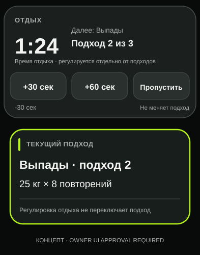
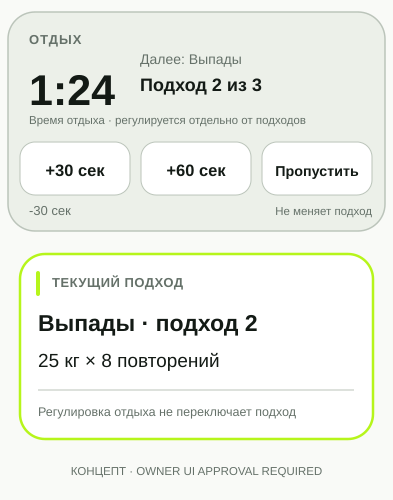

# #914 - макет таймера отдыха (концепция)

**Назначение:** наглядный ориентир для Codex к [Issue #914](https://github.com/MikeMoore1337/your-fitness-coach/issues/914). Не production UI, не утверждённая спецификация геометрии; окончательный вариант требует owner UI approval.

## Макеты

- [Тёмная тема](rest-timer-dark.svg)
- [Светлая тема](rest-timer-light.svg)

## Принципы, которые нужно сохранить

1. Видимый таймер: оставшееся время и контекст следующего подхода.
2. **Три основных действия одинаковой доступности**: `+30 сек`, `+60 сек`, `Пропустить`, каждое имеет отдельную область нажатия не меньше 44 CSS px.
3. **`-30 сек` - необязательная вторичная коррекция**, если её поддерживает текущая модель и её поведение согласовано.
4. Область таймера не перехватывает ввод подхода и не пропускает клики сквозь себя на карточку предыдущего подхода.
5. Изменение времени отдыха **не изменяет идентификатор выбранного подхода, историю, RIR, вес или повторения**, не отправляет set-mutations.
6. Сохранить действующую модель таймера/active workout, сценарии offline/reconnect, background и возврата.
7. На 320/360/393/430 CSS px, в обеих темах, при iOS клавиатуре/safe-area важные действия и текущий подход остаются достижимы.
8. Поведение «Пропустить» соответствует текущему product contract и не вызывает непрошеный переход к прошлому подходу.

## Проверка и ограничения

- Основная проблема - *случайное активирование предыдущего подхода после нажатия `+30 сек`*, а не только неудобное размещение кнопок. Не считать изменённый макет исправлением без диагностики `click/pointer`, `z-index/hit-test` и workout state.
- Статичные SVG не демонстрируют реальную анимацию, keyboard, тайминг и реакцию касаний.
- Перед изменением production UI: `STOP_OWNER_UI_APPROVAL`.
- Для финальной приёмки нужны **реальные AFTER-снимки** и стабильные ссылки на них в GitHub; требуется отдельное разрешение на merge/deploy.
